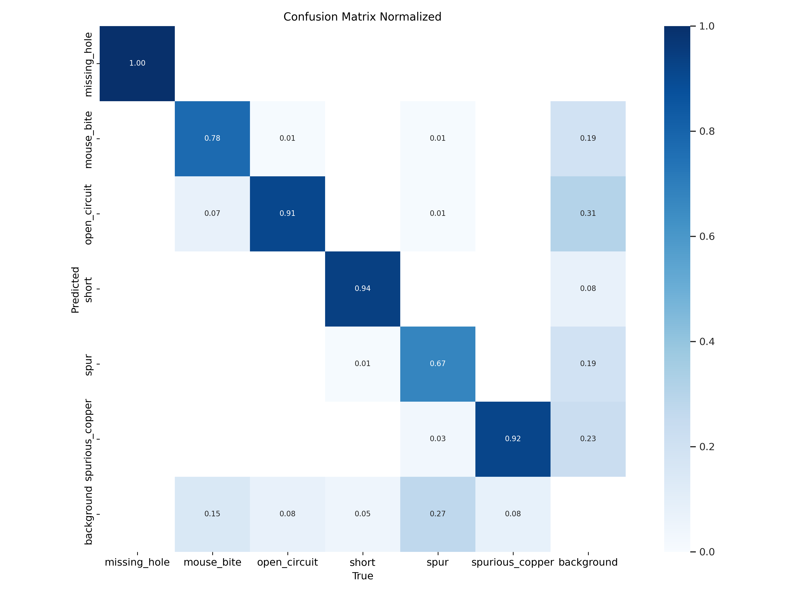
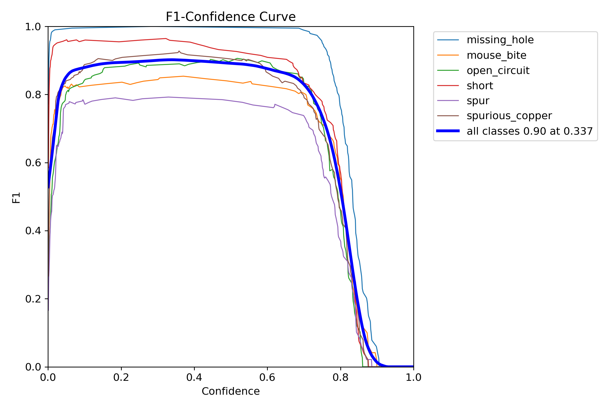
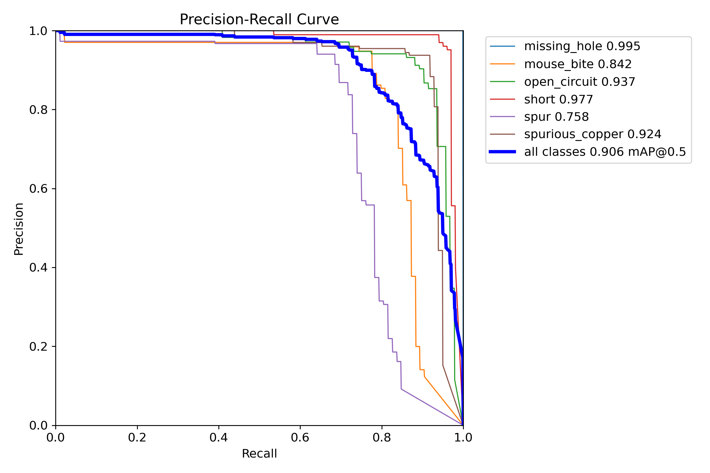
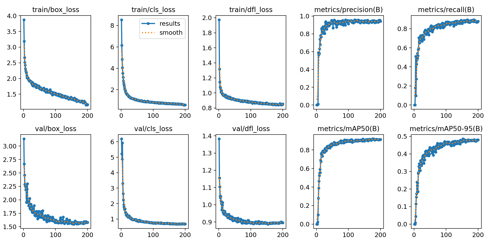
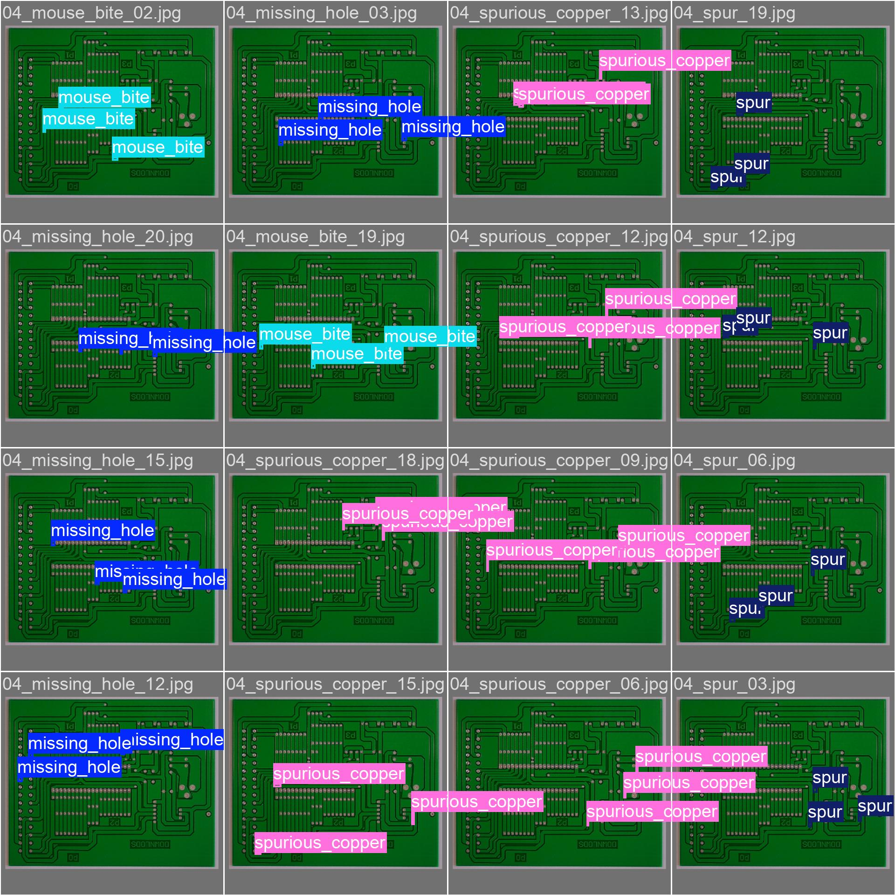
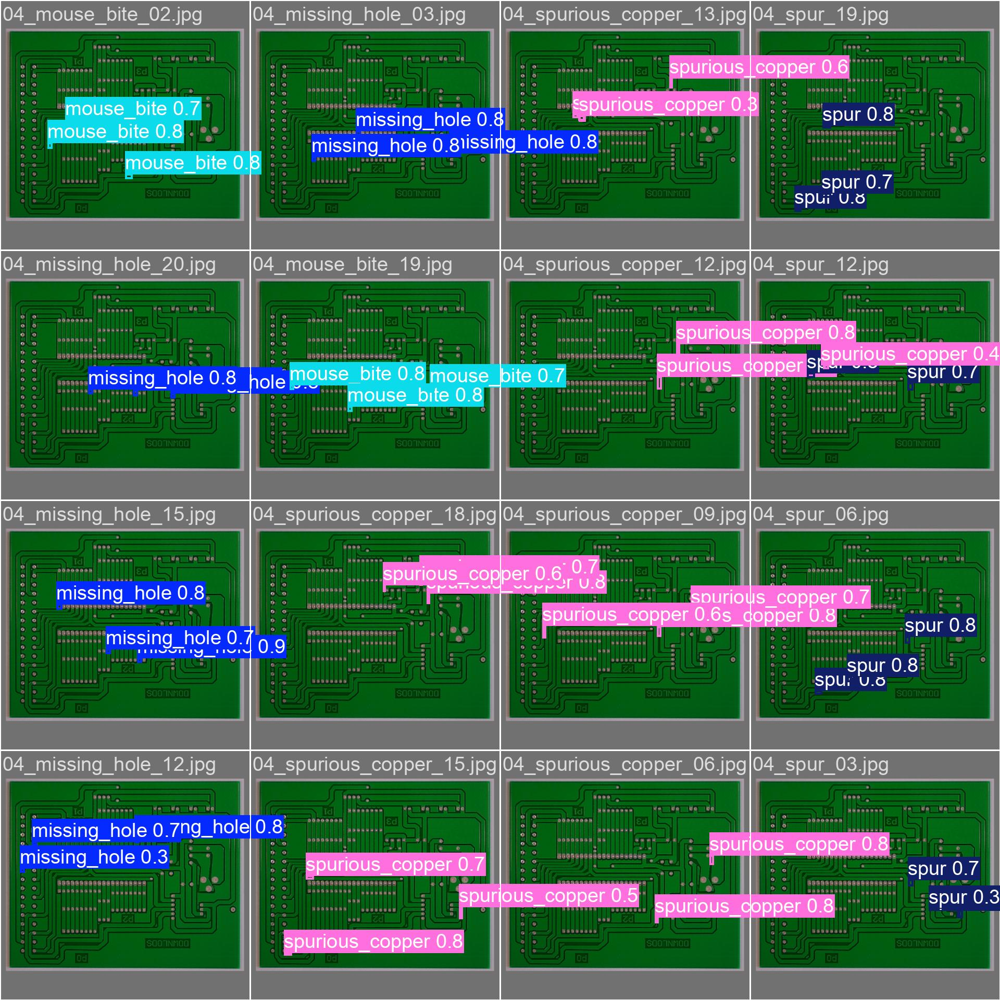

# PCB Defects Detection Using YOLO11n

For this project, I utilized YOLO11n, and this is the  [dataset](https://www.kaggle.com/datasets/akhatova/pcb-defects).

Dataset consists of 6 labels:

- Missing Hole
- Mouse Bite
- Open Circuit
- Short
- Spur
- Spurious Copper

# Installation

- `pip install -r ultralytics/examples YOLOv8-Action-Recognition/requirements.txt`

# To Run the project
### For Apple Silicons
- `python main_apple_silicon.py`

### For PCs/Google Collab
- `python main_pc.py`

# Results from Google Collab

### Confusion Matrix Normalized

### F1 Curve

### PR Curve

### Results

# Testing

### Actual

### Predicted

